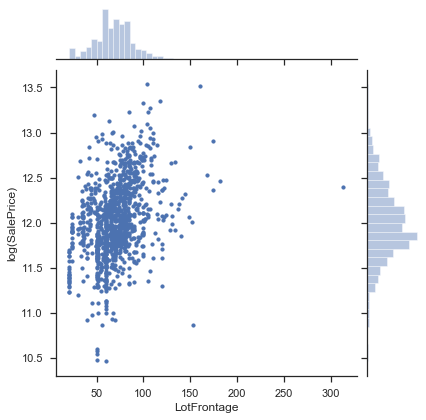
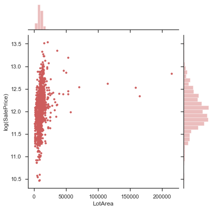
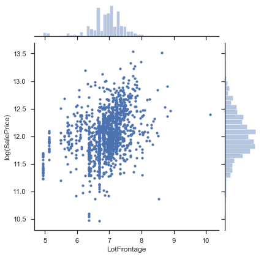
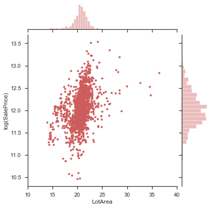
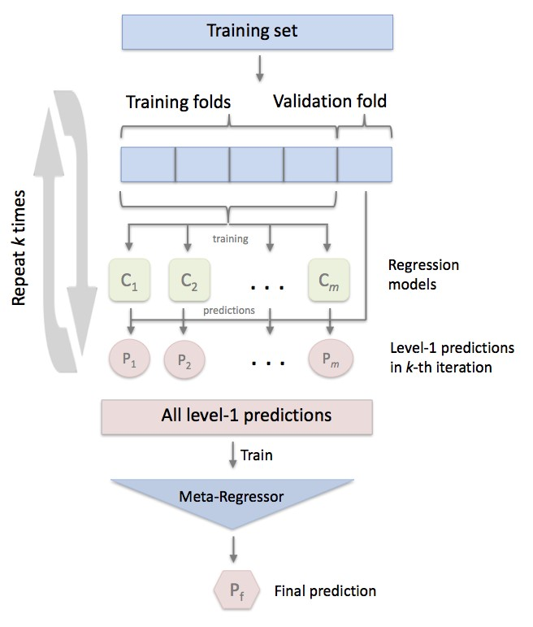
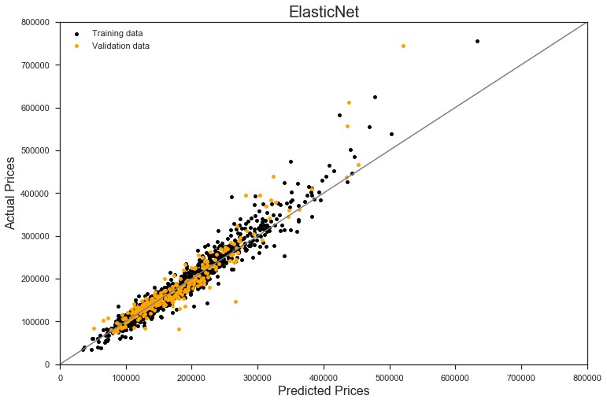
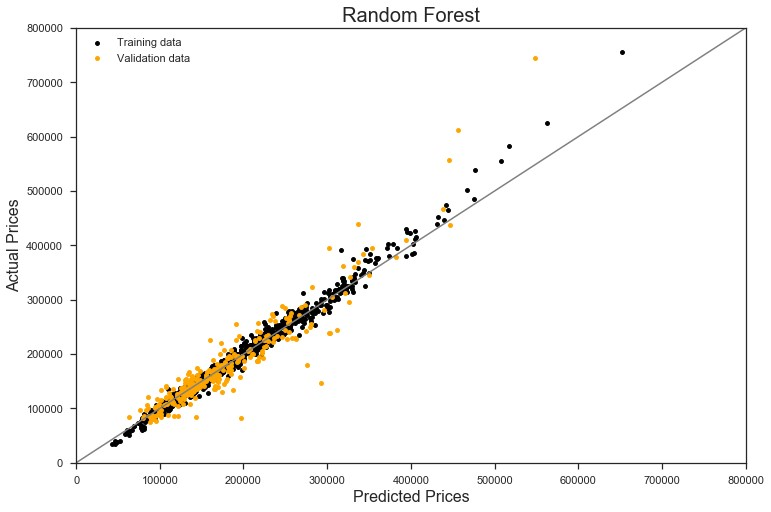
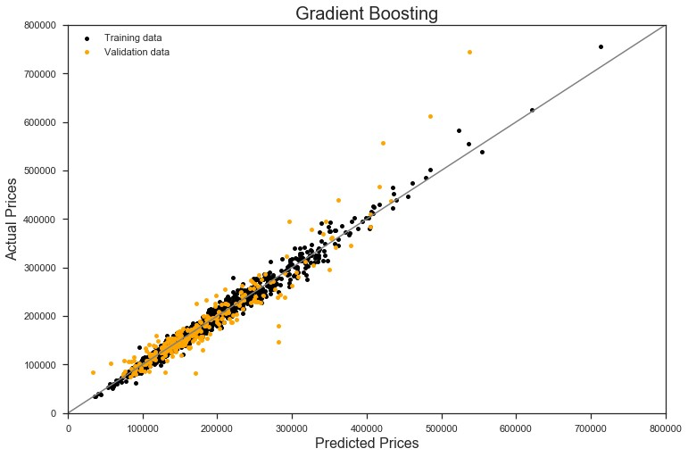
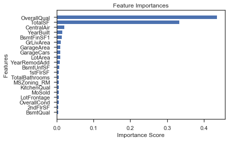
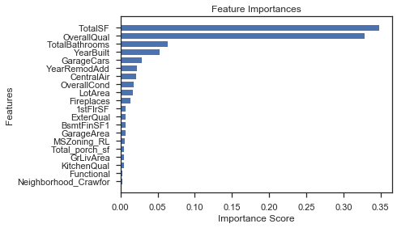

# Ames House Price Prediction - Kaggle Competition

## Overview
This project was conducted to predict house prices in the city of Ames, Iowa using machine learning regression methods. The dataset was collected from a [Kaggle competition, House Prices: Advanced Regression Techniques](https://www.kaggle.com/c/house-prices-advanced-regression-techniques). I conducted an in-depth EDA, missing data imputation, feature engineering, and model building. Five different machine learning regression models, including Lasso, ElasticNet, Random Forest, Gradient Boosting, and XGBoost were trained and applied to predict house prices. In addition, the trained models were fed into develop a stacked model to maximize the accuracy of the prediction. With the results, I was able to identify the most important features that increase home value and recommend investment strategy for homebuyers.

## DATA EXPLORATION
The project began by exploring the features of dataset, which includes the presence of certain amenities, the number of rooms and garages, the size of all spaces, house conditions, ages, etc. Described below are some descriptive examples of the conducted data exploration. 
                          
## DATA PREPROCESSING
In this section, the following two tasks were conducted.

1.	Cleaning outliers
2.	Imputing missing data 

## FEATURE ENGINEERING

### Creating New Features

After completion of imputing missing values, I decided to add the following three new features  to the dataset, which would provide more information about the house prices. 

1.	TotalSF = TotalBsmtSF + 1stFlrSF + 2ndFlrSF
2.	TotalBathrooms = FullBath + 0.5 x HalfBath + BsmtFullBath + 0.5 x BsmtHalfBath
3.	Total_porch_sf = OpenPorchSF + 3SsnPorch + EnclosedPorch + ScreenPorch + WoodDeskSF 

### Encoding Labels of Ordinal Features

The labels of ordinal categorical features were found and they were encoded with values between 0 and n_classes-1.   

### Log Transformation

The skewness of numeric features were reviewed. There are 59 features whose absolute skewness value is greater than 0.75. Then, the skewness of these features were visually checked. Below figures are examples of skewed features.

           |    
:-----------------------------------------------------------------:|:------------------------------------------------------------------:
(a) LotFrontage                                                    |(b) LotArea

After BoxCox transformation, the distributions of these features were changed as shown below.

                              | 
:-----------------------------------------------------------------:|:------------------------------------------------------------------:
(a) LotFrontage                                                    |(b) LotArea

### Dummy Features (OneHot Encoding)

For the categorical features, the get_dummies function of Pandas was applied to the remaining categorical features. Because some machine learning algorithms (e.g., Lasso) cannot operate on label data directly. They require all input variables and output variables to be quantitative. Overall, additional 225 features were created, and the total number of features used for model training was 304. 

## MODELING

As mentioned in the Introduction section, Lasso, ElasticNet, Random Forest, Gradient Boosting, and XGBoost models were trained, and the trained models were used to create a stacked model. I trained a stacked model using StackingCVRegressor package, which improved the prediction results of the five models.

The optimal hyperparameters of each model were tuned using GridSearchCV from the scikit-learn package in Python. This approach trained many models with cross-validation, using a limited number of random combinations from selected ranges of hyperparameters. 

### StackingCVRegressor

Stacking is an ensemble learning technique that combines multiple regression models via a metamodel. “The StackingCVRegressor extends the standard stacking algorithm using out-of-fold predictions to prepare the input data for the level-2 regressor.” The basic conceptual operation of the StackingCVRegressor is illustrated below.

   
[Source: http://rasbt.github.io/mlxtend/user_guide/regressor/StackingCVRegressor](http://rasbt.github.io/mlxtend/user_guide/regressor/StackingCVRegressor/)

### Prediction Performance
The models with the optimal hyperparameters were evaluated by comparing the predictions of each model with validation data. Each model was evaluated using the root mean square error (RMSE) of model predictions, which is a metric for describing the differences between the predicted values and the observed values for SalePrice. Sure, lower RMSE scores are better.
Below are graphs of the predicted values and the observed values in each studied model. As expected, the result from the StackingCVRegressor (i.e., stacked model) was better than the other five models, but the result was very similar to the one obtained with XGBoost.

                              | 
:-------------------------------------------------------------:|:----------------------------------------------------------------------:
(a) Lasso                                                      |(b) ElasticNet

                       | 
:-------------------------------------------------------------:|:----------------------------------------------------------------------:
(c) Random Forest                                              |(d) Gradient Boost

                            |                                     
:-------------------------------------------------------------:|:----------------------------------------------------------------------:
(e) XGBoost                                                    |(f) Stacking

### Feature Importance

Below illustrates the top 20 features in Random Forest, Gradient Boosting, and XGBoost models. The result helps understanding which features are most significant. The three models showed that OverallQual and TotalSF are two most important features.

                       | 
:-----------------------------------------------------------------:|:------------------------------------------------------------------:
(a) Random Forest                                                  |(b) Gradient Boost
                      | 
(c) XGBoost                                                        |                                                 

## CONCLUSIONS

The objective of this project was to build machine learning models to predict house prices in Ames, IA. Two linear models (i.e., Lasso and ElasticNet), as well as Random Forest, Gradient Boosting, XGBoost and Stacking models were used for predictions. As expected, the Stacking model outperformed all the other models. While the stacked model does not explicitly interpret the importance of individual features on house price prediction, Random Forest, Gradient Boosting, and XGBoost found that OverallQual and TotalSF are two most important features. 

When the developed model is used to predict the house prices, buyer should expect an error of approximately $13,000 in the estimated result. Also, it should be note that overall quality (OverallQual) and total square feet of house area (e.g., total square feet of basement (TotalBsmtSF), 1st floor (1stFlrSF), and 2nd floor (2ndFlrSF)) are the two most important features that affects the house prices.

